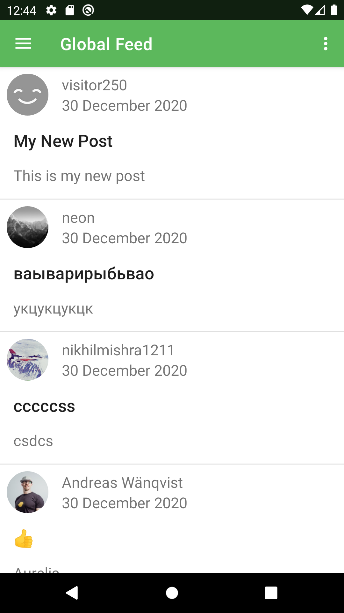
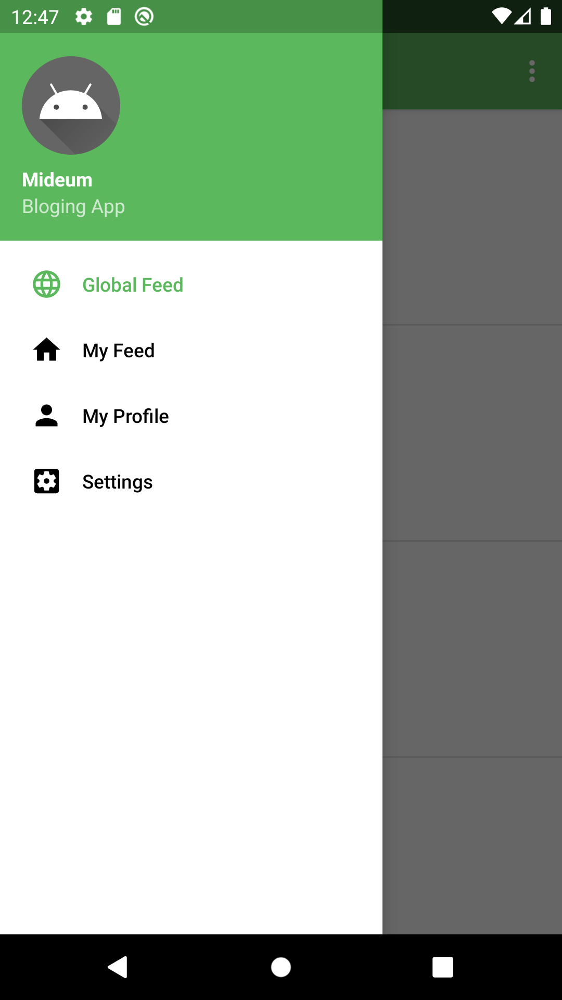
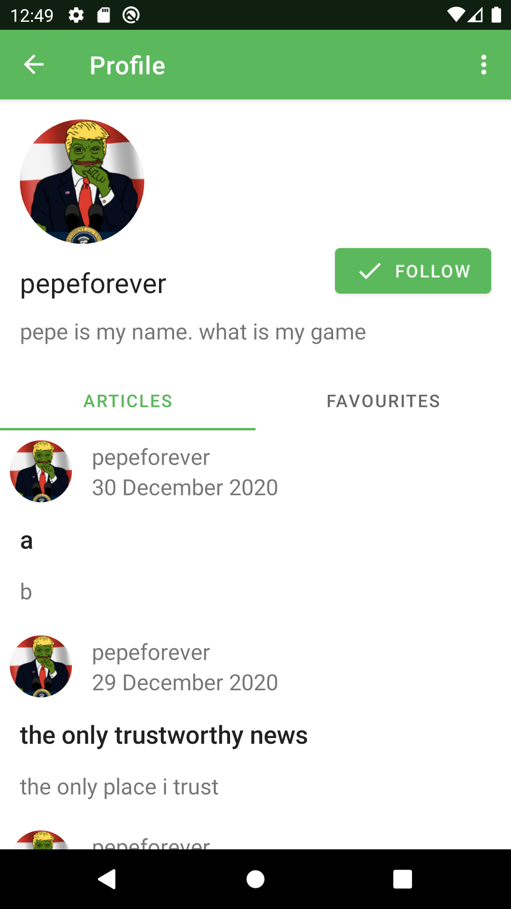
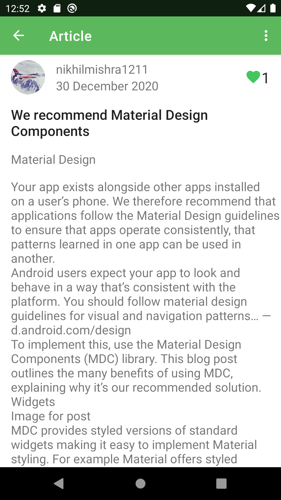
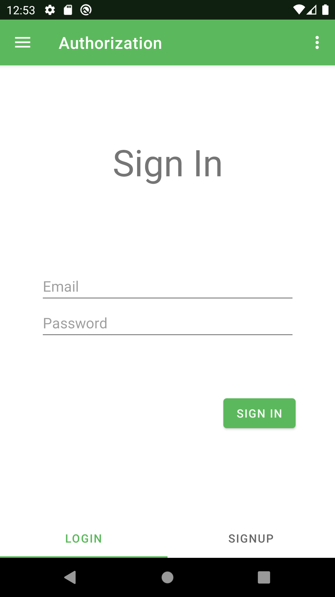

# 

> ### Kotlin codebase containing real world examples (CRUD, auth, advanced patterns, etc) that adheres to the [RealWorld](https://github.com/gothinkster/realworld) spec and API.

### [Demo](https://github.com/gothinkster/realworld)&nbsp;&nbsp;&nbsp;&nbsp;[RealWorld](https://github.com/gothinkster/realworld)

This codebase was created to demonstrate a fully fledged fullstack application built with **Kotlin** including CRUD operations, authentication, routing, pagination, and more.

We've gone to great lengths to adhere to the **Kotlin** community styleguides & best practices.

For more information on how to this works with other frontends/backends, head over to the [RealWorld](https://github.com/gothinkster/realworld) repo.

# How it works

Blogging Android app with user authentication where user can create blog articles , follow other users , favourite articles etc

## Built and design
Built in MVVM(Model view view model) architecture\
communicates with the backend api of [Real world](https://github.com/gothinkster/realworld) using retrofit library\
uses Android Jetpack libraries like navigation
Glide library for image processing

# Screenshots
 
 

